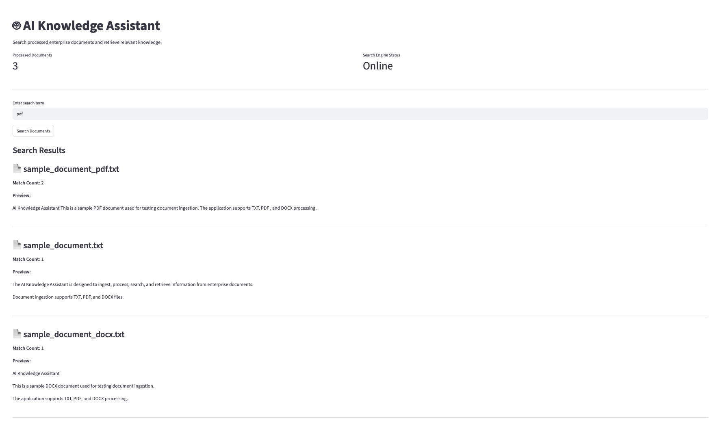
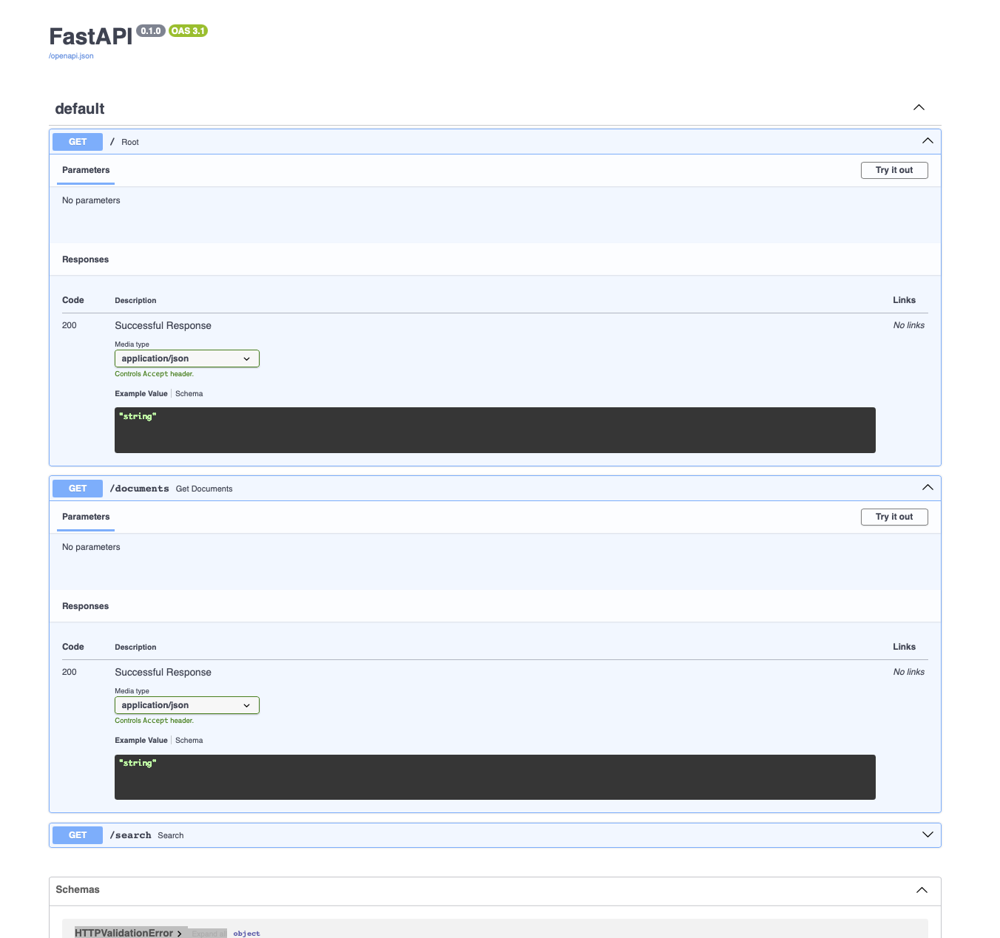

# AI Knowledge Assistant

## Overview

AI Knowledge Assistant is a full-stack software engineering application designed to ingest, process, search, and retrieve information from enterprise documents through a modern web interface.

The application supports TXT, PDF, and DOCX document processing, keyword-based document search, REST API integration, and interactive document retrieval through a Streamlit frontend and FastAPI backend.

Users can search processed documents, view matching results, analyze search relevance through match counts, and review document previews without manually opening individual files.

The project demonstrates real-world software engineering concepts including document ingestion, search engine development, REST API architecture, frontend-backend integration, testing, version control, GitHub workflows, and application deployment practices.

## Supported File Types

- PDF
- DOCX
- TXT

## Key Features

- Multi-format document ingestion (TXT, PDF, DOCX)
- Document processing and normalization
- Keyword-based search engine
- Match count analysis
- Search result previews
- FastAPI REST API integration
- Interactive Streamlit dashboard
- Swagger/OpenAPI documentation
- Professional GitHub workflow

## Application Architecture

```text
User
↓
Streamlit Frontend
↓
FastAPI REST API
↓
Knowledge Search Service
↓
Document Repository
```

## Application Screenshots

### Streamlit Search Interface



### FastAPI Swagger Documentation



## Technology Stack

### Backend

- Python
- FastAPI
- PyPDF2
- python-docx

### Frontend

- Streamlit

### Development Tools

- Git
- GitHub
- PyCharm

### APIs

- REST API
- Swagger / OpenAPI

## Project Status

### Completed Features

- TXT document ingestion
- PDF document ingestion
- DOCX document ingestion
- Document processing engine
- Document search engine
- FastAPI REST API
- Swagger API documentation
- Streamlit frontend dashboard
- GitHub CI/CD workflow

### Current Release

Version 1.0 - Complete

## Future Enhancements

- AI-powered question answering
- React frontend interface
- User authentication and authorization
- Document upload functionality
- Semantic search capabilities
- Vector database integration
- Enterprise analytics dashboard
